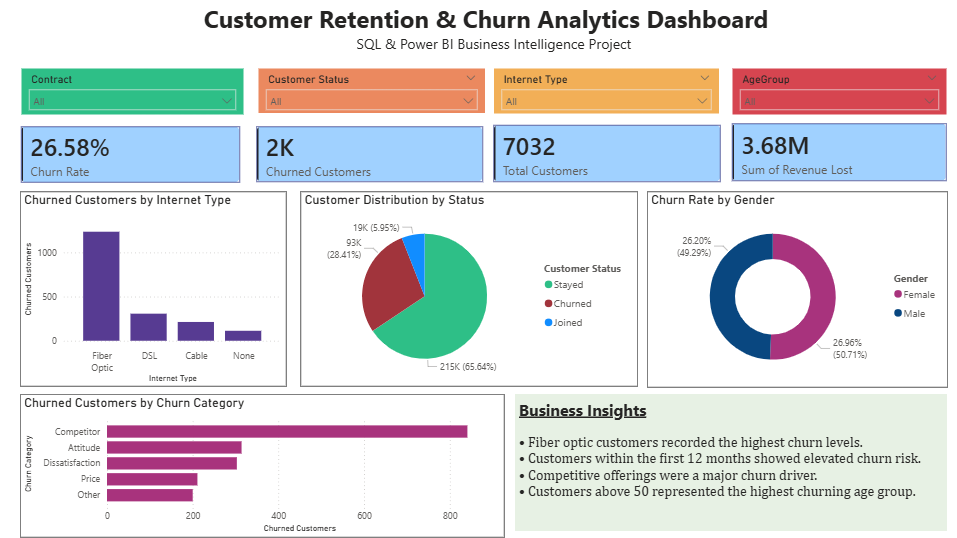

# Customer Retention & Churn Analytics Dashboard

## Project Overview
This project analyzes customer churn patterns using SQL and Power BI. The objective was to identify customer retention risks, churn drivers, customer segments, and revenue impact through business intelligence reporting and interactive dashboards.

## Tools & Technologies
- MySQL
- SQL
- Power BI
- Excel/CSV

## Key Business Insights
- Fiber optic customers recorded the highest churn levels.
- Customers within the first 12 months showed elevated churn risk.
- Competitive offerings were a major churn driver.
- Customers above 50 represented the highest churning age group.

## Dashboard Features
- KPI Cards
- Interactive Slicers
- Churn Segmentation
- Revenue Analysis
- Customer Demographics
- Retention Insights

## Project Structure
- Dataset → Raw datasets used for analysis
- SQL_queries → SQL scripts and analysis queries
- Dashboard → Power BI dashboard files
- screenshots → Dashboard preview images

